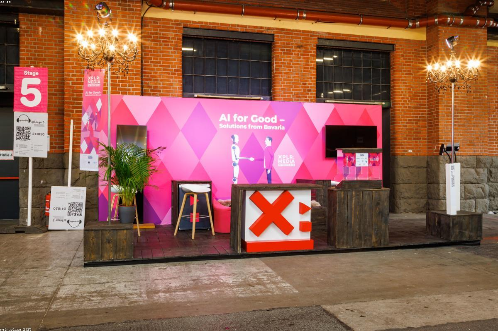
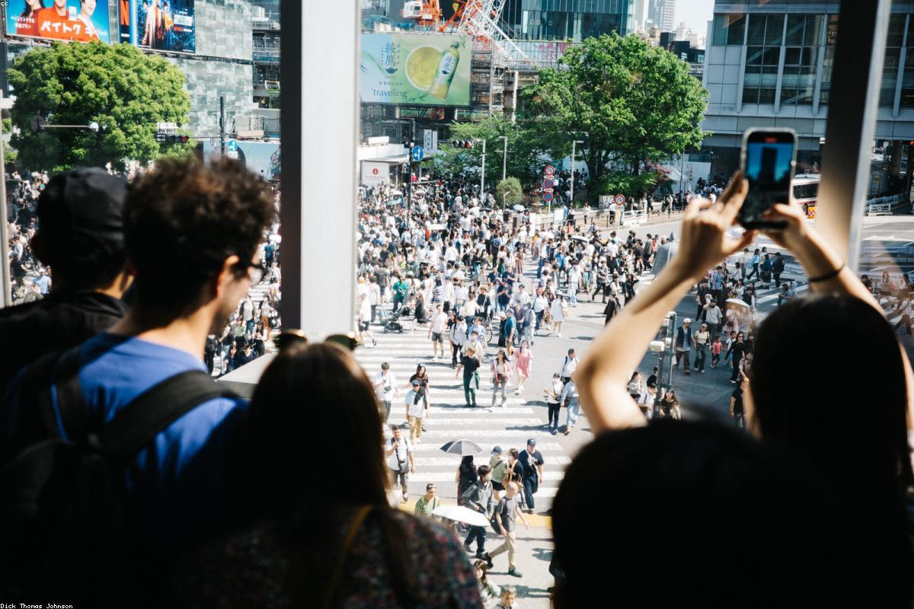
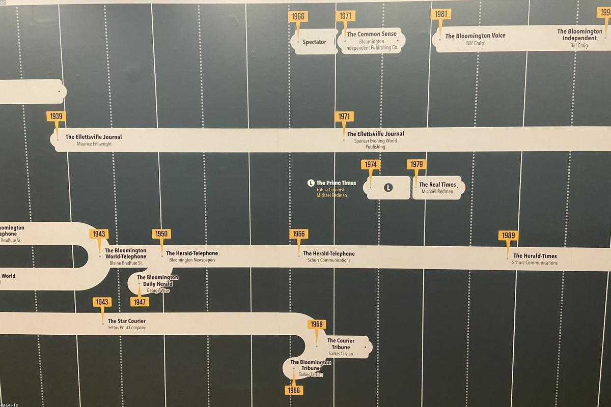

# Contenuti del sito personale — TEMPLATE DI ESEMPIO

> **Nota d'uso**: questo file contiene tutto il testo necessario per il sito personale di un ipotetico studente del 5° anno dell'IIS Marconi Pieralisi di Jesi, indirizzo Informatica e Telecomunicazioni. I dati sono **inventati**: ogni studente deve sostituirli con i propri (nome, foto, esperienze, progetti, premi, ecc.) mantenendo la stessa struttura. I segnaposto del tipo `[DA PERSONALIZZARE]` indicano i punti in cui inserire le proprie informazioni reali.

---

## 0. DATI ANAGRAFICI E IDENTITÀ

- **Nome e Cognome**: Taviani Federico
- **Età**: 19 anni
- **Residenza**: Jesi (AN)
- **Scuola**: IIS "Marconi Pieralisi" di Jesi
- **Indirizzo**: Informatica e Telecomunicazioni — articolazione Informatica
- **Classe**: 5ª CM — Anno scolastico 2025/2026
- **Email**: st10999@iismarconipieralisi.it
- **Instagram**: @fedeetaviaaa._07
- **GitHub**: github.com/TavianTorbian

---

> **Nota importante per la pagina Home**: le sezioni 1, 2 e 3 vivono **sulla stessa pagina (`index.html`)** in scorrimento verticale. Sono state scritte come un unico racconto che si sviluppa naturalmente: prima un saluto breve, poi la presentazione personale e di studi, poi le passioni. Evita quindi qualsiasi "anticipo" tra una sezione e l'altra: ogni argomento viene introdotto una sola volta, nel momento in cui viene approfondito.

## 1. HOME — Hero di apertura

### Titolo della pagina
Taviani Federico

### Sottotitolo
Studente di Informatica — IIS "Marconi Pieralisi", Jesi

### Frase di benvenuto (1 riga sotto il sottotitolo)
Cinque anni di scuola, le cose che mi appassionano, qualche progetto: ecco quello che ho da raccontare.

### Pulsanti CTA dell'hero
- "Scopri di più" → ancora alla sezione "Chi sono" (`#chi-sono`)
- "Le mie materie" → link a `materie.html`

---

### 👤 2. CHI SONO

**🧩 Presentazione**

**🎓 Il mio percorso di studi**

**🚀 Uno sguardo al futuro**

### Immagini suggerite
- `immagini/profilo.jpg` — foto profilo dello studente
- `immagini/iismarconipieralisi.jpg` — istituto Marconi Pieralisi

---

## 3. PASSIONI

### Frase di passaggio (1 riga, fa da ponte con la sezione precedente)
La scuola occupa una parte importante delle mie giornate, ma non è tutto. Ci sono 3 cose che, fuori dall'aula, mi raccontano meglio di qualsiasi voto: la musica, il calcetto, e i viaggi.

**🎧 3.1 Musica**
La musica è sempre stata e sempre avrà un posto nel mio cuore: mi ha accompagnato in molti momenti della mia vita e mi ha molto aiutato. Ascolto generi molto diversi: passo dal metal più brutale al rap o trap moderna per poi tornare al rock o punk. Tanti generi ma mi rispecchiano uno dopo l'altro. tra i miei artisti preferiti ultimamente ho i Distant, band deathcore/slam, gli Invent Animate, band metalcore, Kid yugi, cantante rap italiano e infine i whirr, band shoegaze. Inoltre suono anche degli strumenti: il principale è la batteria che la suono da una decina di anni e poi negli ultimi anni ho imparato a suonare la chitarra da autodidatta. Di questo percorso strumentale sono molto fiero anche per le band che sto costruendo e portando avanti come fossero miei figli.

**⚽ 3.2 Sport — Calcetto**
Gioco a calcetto da quando vevo 5-6 anni. Mi è sempre piaciuto praticare un sport di squadra anche se inizialmente non ero molto affine al gioco di squadra. Poi col tempo son cresciuto e ho capito come effettivamente si doveva giocare e quindi poi mi son divertito molto di più. ho sempre giocato con la stessa squadra con la quale gioco adesso e aver visto tanti cambi d formazione e tanti tornei diversi, questo mi ha portato a conoscere tante persone nuove. Questa realtà mi è sempre piaciuta tantè che se avessi avuto un pizzico di fortuna in più, avrei potuto arrivare anche in alto. Magari ce l'avrò...

**✈️ 3.3 Viaggi**
Viaggiare è una di quelle passioni che ancora non ho potuto mettere in pratica a pieno in quanto non ho ne tempo ne denaro per riuscire a fare i viaggi che mi piacerebbero. Tra le numerose mete che mi piacerebbero visitare ci sono sicuramente il Giappone, la Norvegia e l'America inq uanto sono mete interessanti sia culturalmente che piene di paesaggi naturali veramente mozzafiato. Tra i pochi viaggi che invece ho fatto mi ricordo la Germania quando ero piccolo con la mia famiglia ma mi ricordo poco, dovrei tornarci, e sicuramente l'indimenticabile gita del quinto in Grecia.

### Immagini suggerite per le passioni
- `immagini/passione-musica.jpg`
- `immagini/passione-calcio.jpg`
- `immagini/passione-viaggi.jpg`

---

## 4. MATERIE SCOLASTICHE

> Le materie del 5° anno dell'IIS Marconi Pieralisi (indirizzo Informatica) sono organizzate in area scientifico-tecnica e area umanistica. Per ogni materia segue: paragrafo descrittivo + elenco dei principali argomenti affrontati durante l'anno.

### AREA SCIENTIFICA / TECNICA
**🖥️ Informatica**
Informatica è sempre stata una materia interessante ma con il passare degli anni ho capito che forse non era proprio la scelta igliore per me, però ormai sono arrivato alla fine. Di questo anno sicuramente mi porto dietro l'esperienza di laboratorio che mi è piaciuta di più ovvero la creazione di un sito che funzione come Google Drive. È stata una vera e propria sfida e mi è piaciuto incimentarmi in quelle che erano sia le problematiche di sviluppo ma anche le varie parti di grafica CSS. Sicuramente è stata l'esperienza che in tutto l'anno mi ha dato e fatto imparare di più di tutte le altre.

**Argomenti principali del programma:**
- Linguaggio SQL avanzato: query annidate, viste, stored procedure, trigger
- Progettazione di basi di dati: modello ER, normalizzazione, vincoli di integrità
- Sviluppo backend con PHP e API REST in formato JSON
- Sviluppo frontend con HTML, CSS e JavaScript (DOM, fetch, async/await)
- Progetto di classe: applicazione web per la gestione di emergenze sul territorio
- Versionamento del codice con Git e collaborazione tramite GitHub

**🌐 Sistemi e Reti**
Sistemi è stata sempre una materia che mi è stata sempre a cuore. Mi è sempre piaciuto capire come funzionano i sistemi e di come creare un progetto; di fatti il sistemista sarebbe un ottimo lavoro da intraprendere post diploma. L acosa che mi ha più interessato di quest'anno è la parte di sicurezza informatica e come funziona la comunicazione tra parti, soprattutto dopo aver esposto la presentazione sull'algoritmo di crittografia asimmetrica RSA. È stato divertente a differenza di molte altre cose che durante l'anno non ho capito e non mi sono neanche troppo divertito nel farle.

**Argomenti principali del programma:**
- Modello ISO/OSI e stack TCP/IP a confronto
- Indirizzamento IPv4 e IPv6, subnetting e VLSM
- Routing statico e dinamico (cenni a RIP, OSPF)
- VLAN, trunking e sicurezza nelle reti locali
- Crittografia simmetrica e asimmetrica, certificati digitali, HTTPS
- VPN, firewall e principi base di cybersecurity
- Cloud computing: modelli IaaS, PaaS, SaaS
- Reti wireless, wifi e cablaggio strutturato

**🔌 TPSIT**
TPSIT è stata una materia complessa da inquadrare a pieno. La cosa che più mi ha segnato è sicuramente la concorrenza dei Thread in Java. La presentazione fatta ad inizio anno sui vari problemi della concorrenza è stata una bella sfida, e sinceramente non mi aspettavo che mi avrebbe creato così tanto interesse,infine posso dire che è stato divertente. 

**Argomenti principali del programma:**
- Programmazione multi-thread e gestione della concorrenza in Java
- Porgrammazione di applicazione web con Adnroid Studio

**🗂️ GPOI**
GPOI è entrata quest'anno però mi è stata a cuore fin da subito per essersi distinta dalle altre materie più tecniche. Mi è piaciuto in particolare il progetto Scout Admin per la sua diversità dagli altri progetti e soprattutto di come sono riuscito ad immaginare quella realtà e di come poterla poi progettare. Mi è proprio piaciuto e mi ha interessato. 

**Argomenti principali del programma:**
- Cos'è un progetto, ciclo di vita e fasi
- Metodologie tradizionali: modello a cascata, diagrammi di Gantt e di PERT
- Metodologie agili: Scrum, Kanban, ruoli e cerimonie
- Analisi dei requisiti e stesura di documentazione tecnica
- Stima dei costi, ROI e analisi di fattibilità
- Sicurezza sul lavoro (D.Lgs. 81/08) e qualità (cenni ISO 9001)
- Modelli organizzativi d'impresa e ruoli aziendali nell'IT
- Cloud computing: modelli IaaS, PaaS, SaaS

**📐 Matematica**
La matemqatica è sempre stata una della mie materie in assoluto da quando son bambino. Non ci ho mai messo troppo a capire i concetti e soprattutto mi son sempre esercitato e forse è proprio quello che ha fatto la differenza. la cosa che mi spaventava ma che alla fine invece si è rivelata
una sciocchezza sono stati gli integrali. Inizialmente ti mettono un po' di angoscia perchè pieni di simboli strani e non sai come risolverli, ma posso dire che con un po' di pratica sono anche divertenti da risolvere.

**Argomenti principali del programma:**
- Derivate: definizione, regole di derivazione, applicazioni
- Funzioni a due variabili, curve di livello e punti di massimo, minimo e di sella
- Integrali indefiniti e definiti, metodi di integrazione
- Calcolo di aree e di volumi
- Cenni a equazioni differenziali e probabilità

**🤖 Intelligenza Artificiale**
Intelligenza Artificiale è stata una materia sempre intrigante e che quest'anno siucuramente ha avuto il suo picco di interesse. Da quando abbiamo fatto le reti convoluzionali è stato scoperto un mondo che non solo mi ha appassionato, ma è stato proprio interessante vedere come funzionavano e gli esercizi sono proprio divententi da fare.

**Argomenti principali del programma:**
- Storia dell'intelligenza artificiale: dai primi sistemi esperti al deep learning
- Apprendimento supervisionato: regressione lineare, classificazione, alberi decisionali
- Apprendimento non supervisionato: clustering, riduzione della dimensionalità
- Reti neurali artificiali: percettrone, reti feed-forward, backpropagation
- Convolutional Neural Networks (CNN) per il riconoscimento di immagini
- Strumenti di lavoro: Python, NumPy, Pandas 

### AREA UMANISTICA

**📚 Italiano**
L'Italiano mi ha permesso di esplorare la lingua, la letteratura e la cultura del nostro Paese attraverso testi, autori e movimenti che hanno segnato la storia. Tra tutti gli argomenti affrontati, ciò che mi ha colpito di più sono stati i poeti maledetti, capaci di trasformare la poesia in un’esperienza estrema, provocatoria e profondamente emotiva.

**Argomenti principali del programma:**
- Giacomo Leopardi: pensiero, poetica e opere principali
- I poeti maledetti: Baudelaire, Verlaine e Rimbaud
- Naturalismo e Verismo: Giovanni Verga e i "Malavoglia"
- Decadentismo: Pascoli e D'Annunzio
- Le avanguardie del primo Novecento e il Futurismo
- Italo Svevo e Luigi Pirandello: la crisi dell'io
- La poesia del Novecento: Ungaretti, Montale
- Il neorealismo: Calvino

**🕰️ Storia**
La materia Storia mi ha permesso di comprendere l’evoluzione delle società umane attraverso eventi, trasformazioni politiche e cambiamenti culturali che hanno segnato il mondo. Tra i vari periodi affrontati, quello che mi ha coinvolto maggiormente è stata la Seconda Guerra Mondiale: un conflitto globale complesso e drammatico, che ha mostrato sia gli orrori della guerra sia la capacità dei popoli di resistere, organizzarsi e ricostruire.

**Argomenti principali del programma:**
- L'Italia dell'età giolittiana e la seconda rivoluzione industriale
- La Prima Guerra Mondiale e le sue conseguenze
- I totalitarismi: fascismo, nazismo, stalinismo
- La Seconda Guerra Mondiale e la Shoah
- La nascita della Repubblica italiana e la Costituzione
- La Guerra Fredda e la decolonizzazione
- L'Italia del dopoguerra: boom economico, anni di piombo, Tangentopoli

**🇬🇧 Inglese**
La materia Inglese mi ha permesso di conoscere non solo la lingua, ma anche la cultura e la storia del mondo anglosassone attraverso testi, autori e periodi. Tra i vari argomenti studiati, quello che mi ha affascinato di più è stata la Victorian Age: un’epoca di grandi cambiamenti sociali, scientifici e tecnologici, segnata da figure come Dickens e la stessa regina Vittoria.

**Argomenti principali del programma:**
- Letteratura: il romanzo vittoriano, Orwell e la distopia, cenni di poesia moderna
- Technical English: networking, programming, cybersecurity
- Preparazione a certificazioni linguistiche (livello B2)
- Storytelling: presentare progetti tecnici in lingua inglese
- Civiltà britannica e statunitense

### ALTRO
**🏃 Scienze Motorie**
La materia Scienze Motorie mi ha aiutato a comprendere come il movimento, l’attività fisica e la salute siano strettamente collegati al funzionamento del nostro organismo. Tra i vari argomenti affrontati, quello che mi ha appassionato di più è stato lo apparato cardiocircolatorio. Studiare come è fatto il corpo umano e come funzionano i suoi apparati è ciò che mi coinvolge maggiormente, perché mi permette di capire davvero cosa accade “dietro le quinte” quando ci muoviamo, respiriamo e ci alleniamo.

**Argomenti principali del programma:**
- Sport di squadra: pallavolo, basket, calcio a 5
- Apparato Cardio-Circolatorio

---

### EDUCAZIONE CIVICA
**🛡️ Educazione Civica**
Il percorso di Educazione Civica è stato dedicato alla cittadinanza digitale, un tema sempre più centrale. Abbiamo analizzato rischi e opportunità della vita online: cyberbullismo, privacy, uso dei dati, disinformazione. Un percorso che ci ha fatto riflettere sul ruolo che abbiamo come utenti consapevoli della rete.

### Titolo del percorso
**La disinformazione dell'informazione!**

### 5.1 Introduzione al tema
Trascorriamo online buona parte della nostra giornata, eppure quasi nessuno ci ha mai insegnato a starci. Per il percorso di Educazione Civica ho scelto la cittadinanza digitale: cosa significa partecipare alla vita pubblica in rete in modo consapevole, e cosa accade quando questa consapevolezza manca — dal cyberbullismo alla disinformazione, fino all'uso disinvolto dei nostri dati personali.

### 5.2 Cos'è la cittadinanza digitale
Essere cittadini digitali significa partecipare in modo attivo, consapevole e responsabile alla vita della società attraverso gli strumenti digitali. Implica conoscere i propri diritti (alla privacy, all'oblio, alla protezione dei dati personali) e i propri doveri (rispetto degli altri, attendibilità delle informazioni che si condividono, uso etico delle tecnologie). La cittadinanza digitale non è un concetto astratto: si esercita ogni volta che pubblichiamo un post, che chiediamo un'informazione a un assistente vocale, che usiamo una carta di credito online.

### 5.3 Il cyberbullismo
Il cyberbullismo è una delle forme più insidiose di violenza che la rete ha reso possibile. A differenza del bullismo tradizionale, agisce 24 ore su 24, può raggiungere un pubblico potenzialmente illimitato, e spesso si nasconde dietro l'anonimato. Le forme più comuni includono insulti ripetuti tramite messaggi, diffusione non consensuale di immagini, esclusione sistematica dai gruppi online e creazione di profili falsi per danneggiare la reputazione di qualcuno. In Italia, la legge 71/2017 è stata la prima in Europa a contrastare specificamente il cyberbullismo.

### 5.4 Privacy e protezione dei dati
Ogni clic, ogni ricerca, ogni "mi piace" lascia una traccia. Il Regolamento Generale sulla Protezione dei Dati (GDPR), entrato in vigore in tutta l'Unione Europea nel 2018, ha rappresentato un passo fondamentale per restituire alle persone il controllo sui propri dati personali. Capire concetti come consenso informato, diritto all'oblio, data breach e profilazione è oggi una competenza di base, esattamente come saper leggere un contratto.

### 5.5 Disinformazione e pensiero critico
Le fake news non sono un'invenzione di oggi, ma i social network le hanno trasformate in un fenomeno di massa. Riconoscere una notizia falsa richiede tempo, strumenti e abitudini mentali che vanno coltivate: verificare la fonte, confrontare più testate affidabili, diffidare dei titoli "acchiappa-click", fare attenzione a immagini e video manipolati (deep fake). La scuola e la famiglia hanno un ruolo fondamentale nell'educare al pensiero critico digitale.

### 5.6 Conclusione
La cittadinanza digitale non è una questione tecnica, ma una questione di responsabilità. Le competenze tecnologiche che acquisiamo a scuola hanno senso solo se accompagnate da una bussola etica: la rete può essere un luogo straordinario di crescita e di incontro, ma solo se ognuno di noi sceglie di esserci con rispetto, onestà e consapevolezza. Il mio percorso scolastico in Informatica mi ha dato gli strumenti per comprendere come funziona la tecnologia: ora sta a me, e a tutti i miei coetanei, decidere come usarla.

---

## 6. FSL — Formazione Scuola Lavoro

### L'azienda: Syeew Srl

Durante le settimane di FSL ho avuto l’opportunità di entrare in contatto con una realtà aziendale che mi ha permesso di crescere sia a livello tecnico sia a livello personale. Fin dal primo giorno mi sono sentito accolto e inserito in un ambiente sereno e disponibile, dove ogni dubbio veniva ascoltato e chiarito. L’esperienza si è rivelata molto più interessante di quanto immaginassi, permettendomi di scoprire linguaggi di programmazione e strumenti nuovi, ma anche di mettermi alla prova con problematiche concrete che richiedevano impegno, pazienza e capacità di adattamento.
Nei primi giorni l’azienda mi ha spiegato in cosa consiste il progetto su cui avrei lavorato: la realizzazione di una dashboard in Angular, pensata per la parte manageriale e amministrativa di un’applicazione dedicata alla gestione dei bilanci di locali come bar, ristoranti o altre attività simili.
All’inizio mi sentivo un po’ spaesato, ma già dal secondo giorno ho acquisito maggiore sicurezza e ho iniziato a lavorare con entusiasmo.
Il lavoro prevedeva sia la parte di backend che quella di frontend.
Per il backend ho dovuto creare un server che, attraverso un database, metteva a disposizione i dati tramite delle API-REST sotto forma di file .json. Questa parte è stata molto interessante: ho realizzato il database tramite console con query SQL di base, simili a quelle affrontate a scuola.
In seguito mi sono concentrato sul frontend, cioè il lato client, con l’obiettivo di visualizzare i dati sui grafici della dashboard. All’inizio HTML e CSS mi sembravano complicati perché non li conoscevo, ma dedicando del tempo allo studio sono riuscito a comprenderli. Con Angular, invece, ho avuto qualche difficoltà in più, ma passo dopo passo sono riuscito a iniziare a lavorare.
In generale, la prima settimana è stata positiva: mi sono divertito, ho imparato molto e mi sono sentito subito parte integrante del progetto.
La seconda settimana è stata più impegnativa. Ho incontrato diversi ostacoli, alcuni dei quali hanno richiesto anche più giorni per essere superati. Tuttavia, ogni volta che trovavo la soluzione, la soddisfazione era grande.
Ho lavorato soprattutto sul frontend, rendendo il codice più leggibile ed efficiente. Inizialmente il progetto era strutturato in un unico file, ma l’ho suddiviso in più file dedicati: uno per le rotte, uno per la gestione della dashboard, uno per la pagina principale, un altro per l’intercettazione degli errori e così via. Questa suddivisione ha migliorato la chiarezza del progetto.
Anche il backend ha richiesto qualche aggiornamento: ho aggiunto alcuni metodi per le query SQL e corretto piccoli errori. Alla fine della settimana il backend era quasi completo.
L’ambiente aziendale continuava a essere piacevole e motivante, cosa che mi ha aiutato a rimanere concentrato e interessato.
La terza settimana è stata dedicata al perfezionamento. Dopo aver completato gran parte della base del progetto, ho lavorato sui controlli e filtri per data e località. Questo era un passaggio fondamentale, perché i dati provenivano da recensioni relative a più locali e distribuite su periodi diversi.
Ho modificato i metodi del backend per permettere all’utente di scegliere se avere un’API-REST normale o filtrata in base ai parametri passati. Le query sono quindi diventate dinamiche. Nel frontend ho implementato un componente chiamato datepicker, che permetteva di selezionare l’intervallo di date. È stato necessario anche inserire controlli, per esempio impedendo che la data di inizio fosse successiva alla data di fine o che uscisse dai limiti del database.
Dopo il filtraggio per date, ho implementato quello per località, più semplice da gestire.
È stato un lavoro lungo, soprattutto per il datepicker che mi ha portato via buona parte della settimana, ma il risultato è stato molto utile. Alla fine mi sono reso conto di quanto stessi imparando: concetti che all’inizio mi sembravano complessi erano diventati più chiari, e questo mi ha dato molta soddisfazione.
Dopo le vacanze ho ripreso il lavoro con una fase di revisione del codice. Era ancora troppo grezzo e pieno di ripetizioni, quindi ho dedicato due giorni a riorganizzarlo. In seguito mi sono occupato della schermata di login, implementata con token JWT e protocollo HTTPS.
Questa parte è stata particolarmente difficile perché non avevo mai affrontato l’argomento. Ho studiato e sperimentato fino a riuscire a implementare una soluzione funzionante. L’utente poteva decidere se registrarsi o accedere, e la password veniva hashata nel backend prima di essere salvata nel database. All’inizio ho avuto qualche problema, soprattutto per la questione della sicurezza, ma ho capito che con l’arrivo dell’HTTPS sarebbe stato più sicuro mantenere l’hashing nel backend.
È stato un passaggio complesso, ma molto formativo: ho capito quanto sia importante la sicurezza nei sistemi informatici.
L’ultima settimana è stata la più intensa. Ho dovuto implementare nuove funzionalità e al tempo stesso affrontare difficoltà tecniche non banali. Per prima cosa ho configurato il progetto su HTTPS, risolvendo alcuni problemi iniziali.
In seguito mi sono concentrato sulla gestione dei ruoli degli utenti. Era necessario distinguere tra utenti standard e amministratori. Gli utenti standard potevano soltanto visualizzare i grafici, mentre gli amministratori avevano un vero e proprio pannello di controllo per modificare i dati delle recensioni nel database.
Per realizzare questa divisione ho aggiunto un attributo “role” al database e ho utilizzato una funzione di middleware nel backend, in grado di controllare i permessi di ogni utente prima dell’accesso alle funzionalità.
Questa parte è stata complessa, ma mi ha fatto comprendere ancora meglio l’organizzazione e la logica di un’applicazione web moderna.
L’esperienza di FSL è stata molto positiva e ha superato di gran lunga le mie aspettative. All’inizio pensavo che sarebbe stato noioso e che avrei avuto poco da fare, ma mi sono dovuto ricredere. Ogni giorno ho imparato qualcosa di nuovo: da Angular a HTML e CSS, dalle API-REST ai token JWT, fino alla gestione dei ruoli con middleware.
Ho affrontato momenti difficili, ma con pazienza e impegno sono sempre riuscito a superarli. Ho imparato a scrivere codice più ordinato, a gestire errori e imprevisti e soprattutto ad avere più fiducia nelle mie capacità.
Questa esperienza mi ha reso più preparato in vista del quinto anno e mi ha fatto capire che lavorare in un ambiente collaborativo e stimolante rende l’apprendimento non solo utile, ma anche piacevole.
In conclusione, considero il mio FSL un percorso di crescita tecnica e personale che mi ha dato motivazione e nuove competenze per il futuro.

![Esperienza PCTO] (immagini/pcto-sede.jpg)

---

## 7. CONTATTI

- **Email**: st10999@iismarconipieralisi.it
- **Telefono**: +39 3760279896
- **Indirizzo**: Via Mattia Capponi, 16 — 60035 Jesi (AN)
- **GitHub**: github.com/TavianTorbian
- **Instagram**: @fedeetaviaaa._07

---

## 8. NOTE DI STILE E TONO PER LA SCRITTURA

> Da ricordare quando si personalizzano i contenuti per il proprio sito personale.

- **Tono**: caldo ma misurato, mai eccessivamente informale. Lo studente racconta sé stesso a un pubblico ampio (commissione d'esame, futuri datori di lavoro, conoscenti).
- **Persona**: prima persona singolare ("Io credo che...", "Durante il quinto anno ho avuto modo di...").
- **Lunghezza dei paragrafi**: medi (4-7 righe). Evitare frasi troppo brevi e telegrafiche, ma anche periodi infiniti.
- **Tecnicismi**: usarli quando servono (è una scuola tecnica), ma sempre con un breve chiarimento.
- **Coerenza**: la persona descritta in "Chi sono" deve essere coerente con le passioni, con le scelte fatte nel percorso e con quanto raccontato del PCTO.
- **Aggiornamento**: ogni studente sostituisce nomi, date, aziende, premi, foto e dettagli personali con i propri.

---

## 9. APPENDICE — Mappa delle immagini disponibili

> Nella cartella `immagini/` ci sono **25 immagini** già pronte (royalty-free, scaricate da LoremFlickr). Usa esattamente questi nomi file quando inserisci i tag `` nelle pagine HTML. Tutte le immagini hanno una risoluzione di 1200×800 px.

### Profilo e scuola
- `immagini/profilo.jpg` — foto profilo dello studente (PLACEHOLDER, da sostituire con foto reale)
- `immagini/scuola-marconi.jpg` — istituto Marconi Pieralisi

### Passioni
- `immagini/passione-musica.jpg`
- `immagini/passione-calcio.jpg`
- `immagini/passione-viaggi.jpg`

### Materie — area scientifica/tecnica
- `immagini/materia-informatica.jpg`
- `immagini/materia-sistemi-reti.jpg`
- `immagini/materia-tpsit.jpg`
- `immagini/materia-gpoi.jpg`
- `immagini/materia-matematica.jpg`
- `immagini/materia-ia.jpg` (Intelligenza Artificiale)

### Materie — area umanistica
- `immagini/materia-italiano.jpg`
- `immagini/materia-storia.jpg`
- `immagini/materia-inglese.jpg`

### Altre materie
- `immagini/materia-scienze-motorie.jpg`

### Educazione Civica
- `immagini/edcivica-cittadinanza-digitale.jpg` (apertura del percorso)
- `immagini/edcivica-cyberbullismo.jpg` (sezione cyberbullismo)
- `immagini/edcivica-fake-news.jpg` (sezione disinformazione)

### FSL
- `immagini/pcto-sede.jpg` (sede NovaTech Solutions)
- `immagini/pcto-team.jpg` (lavoro di gruppo)

### Nota su licenze
Le immagini sono fornite tramite LoremFlickr (Flickr Creative Commons). Vanno **sostituite con foto proprie o esplicitamente royalty-free** prima della pubblicazione definitiva del sito. Fonti consigliate per il sostituto: [Unsplash](https://unsplash.com), [Pexels](https://pexels.com), [Pixabay](https://pixabay.com).
